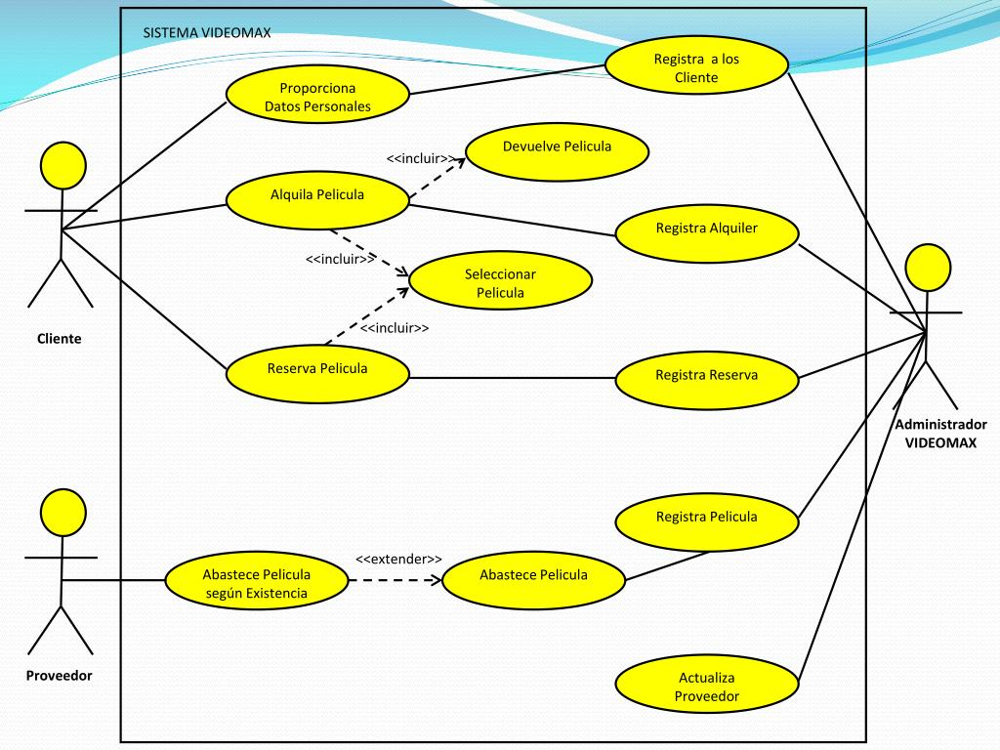

# Tienda de comercio electrónico

# Sistema Videomax

## Actores

### Cliente

| Actor | Cliente |
|---|---|
| Descripción | Cliente común |
| Características | _Características que describen al actor_ |
| Relaciones ||
| Referencias | Proporciona datos personales, Alquila peliculas, Reserva peliculas |   
| Notas ||
| Autor | Alexander Faustino Diaz Bautista |
| Fecha | 19/Nov/2024 |

### Proveedor

| Actor | Proveedor |
|---|---|
| Descripción | Provee peliculas |
| Características ||
| Relaciones ||
| Referencias | Abastece peliculas segun existencias |   
| Notas ||
| Autor | Alexander Faustino Diaz Bautista |
| Fecha | 19/Nov/2024 |

### Administrador

| Actor | Administrador |
|---|---|
| Descripción | Administrador de videomax |
| Características ||
| Relaciones ||
| Referencias | Registrar clientes, Registrar alquiler, Registrar reserva, Registrar pelicula, Actualizar proveedor |   
| Notas ||
| Autor | Alexander Faustino Diaz Bautista |
| Fecha | 19/Nov/2024 |

## Casos de uso

### Proporcionar datos personales

| Caso de Uso CU.1 | Proporcionar datos personales |
|---|---|
| Fuentes | [GibHub jpexposito](https://github.com/jpexposito/code-learn-practice/tree/main/primero/ets/unidades/unidad-3/simulacro-1) |
| Actor | Cliente |
| Descripción | El cliente proporciona sus datos personales |
| Flujo básico ||
| Pre-condiciones ||  
| Post-condiciones | Que el sistema registre al cliente |  
| Requerimientos ||
| Notas ||
| Autor | Alexander Faustino Diaz Bautista |
| Fecha | 19/Nov/2024 |

### Alquilar peliculas

| Caso de Uso CU.2 | Alquilar peliculas |
|---|---|
| Fuentes | [GibHub jpexposito](https://github.com/jpexposito/code-learn-practice/tree/main/primero/ets/unidades/unidad-3/simulacro-1) |
| Actor | Cliente |
| Descripción | El cliente alquila peliculas |
| Flujo básico | Selecciona la pelicula a alquilar y la alquila |
| Pre-condiciones | Seleccionar la pelicula |  
| Post-condiciones | Devolver la pelicula |  
| Requerimientos ||
| Notas | El sistema registra el alquiler |
| Autor | Alexander Faustino Diaz Bautista |
| Fecha | 19/Nov/2024 |

### Reservar pelicula

| Caso de Uso CU.3 | Reservar peliculas |
|---|---|
| Fuentes | [GibHub jpexposito](https://github.com/jpexposito/code-learn-practice/tree/main/primero/ets/unidades/unidad-3/simulacro-1) |
| Actor | Cliente |
| Descripción | El cliente reserva peliculas |
| Flujo básico | Selecciona la pelicula a reservar y la reservar |
| Pre-condiciones | Seleccionar la pelicula |  
| Post-condiciones ||  
| Requerimientos ||
| Notas | El sistema registra la reserva |
| Autor | Alexander Faustino Diaz Bautista |
| Fecha | 19/Nov/2024 |

### Abastecer peliculas 

| Caso de Uso CU.4 | Abastecer peliculas |
|---|---|
| Fuentes | [GibHub jpexposito](https://github.com/jpexposito/code-learn-practice/tree/main/primero/ets/unidades/unidad-3/simulacro-1) |
| Actor | Proveedor |
| Descripción | El proveedor provee de peliculas |
| Flujo básico | Abastece de peliculas segun existencias |
| Pre-condiciones ||  
| Post-condiciones ||  
| Requerimientos ||
| Notas | El sistema registra las peliculas |
| Autor | Alexander Faustino Diaz Bautista |
| Fecha | 19/Nov/2024 |

### Registra a los clientes 

| Caso de Uso CU.5 | Registra a los clientes |
|---|---|
| Fuentes | [GibHub jpexposito](https://github.com/jpexposito/code-learn-practice/tree/main/primero/ets/unidades/unidad-3/simulacro-1) |
| Actor | Administrador |
| Descripción | El sistema registra a los clientes |
| Flujo básico ||
| Pre-condiciones | El cliente proporciona sus datos |  
| Post-condiciones ||  
| Requerimientos ||
| Notas ||
| Autor | Alexander Faustino Diaz Bautista |
| Fecha | 19/Nov/2024 |

### Registrar alquiler 

| Caso de Uso CU.6 | Registra alquiler |
|---|---|
| Fuentes | [GibHub jpexposito](https://github.com/jpexposito/code-learn-practice/tree/main/primero/ets/unidades/unidad-3/simulacro-1) |
| Actor | Administrador |
| Descripción | El sistema registra los alquileres |
| Flujo básico ||
| Pre-condiciones | El cliente alquila una pelicula |
| Post-condiciones ||
| Requerimientos | El cliente alquila una pelicula |
| Notas ||
| Autor | Alexander Faustino Diaz Bautista |
| Fecha | 19/Nov/2024 |

### Registrar reserva

| Caso de Uso CU.7 | Registrar reserva |
|---|---|
| Fuentes | [GibHub jpexposito](https://github.com/jpexposito/code-learn-practice/tree/main/primero/ets/unidades/unidad-3/simulacro-1) |
| Actor | Administrador |
| Descripción | El sistema registra las reservas |
| Flujo básico ||
| Pre-condiciones | El cliente realiza una reserva |  
| Post-condiciones ||
| Requerimientos | El cliente realiza una reserva |
| Notas ||
| Autor | Alexander Faustino Diaz Bautista |
| Fecha | 19/Nov/2024 |

### Registrar peliculas

| Caso de Uso CU.8 | Registrar peliculas |
|---|---|
| Fuentes | [GibHub jpexposito](https://github.com/jpexposito/code-learn-practice/tree/main/primero/ets/unidades/unidad-3/simulacro-1) |
| Actor | Administrador |
| Descripción | El sistema registra las peliculas |
| Flujo básico ||
| Pre-condiciones | El proveedor proovea peliculas |  
| Post-condiciones ||
| Requerimientos | El proveedor proovea peliculas |
| Notas ||
| Autor | Alexander Faustino Diaz Bautista |
| Fecha | 19/Nov/2024 |

### Actualizar proveedor

| Caso de Uso CU.9 | Actualizar proveedor |
|---|---|
| Fuentes | [GibHub jpexposito](https://github.com/jpexposito/code-learn-practice/tree/main/primero/ets/unidades/unidad-3/simulacro-1) |
| Actor | Administrador |
| Descripción | El sistema actualiza al proveedor |
| Flujo básico ||
| Pre-condiciones ||
| Post-condiciones ||
| Requerimientos ||
| Notas | Creo que este caso de uso deveria estar conectado con el caso del uso del proveedor |
| Autor | Alexander Faustino Diaz Bautista |
| Fecha | 19/Nov/2024 |